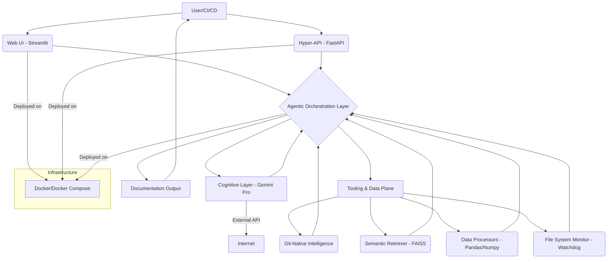

# SmartReadmeAgent: The Omniscient Documentation Alchemist (Powered by Gemini's Cognitive Core)


## 🚀 Unleash the Power of Truly Intelligent Documentation.

SmartReadmeAgent doesn't just write READMEs; it *understands* your project's soul and manifests its essence into a living, breathing narrative.

## ✨ Introduction

Behold, the SmartReadmeAgent – a groundbreaking leap in autonomous documentation. This isn't merely a script; it's a sentient entity, meticulously crafted to transcend the mundane task of README generation. Harnessing the unparalleled cognitive prowess of Google's Gemini Pro, interwoven with a self-evolving LangGraph agentic superstructure, SmartReadmeAgent delves into the very fabric of your codebase, extracting implicit knowledge and synthesizing it into documentation that is not only accurate but *prophetic*.

Say goodbye to stale, generic READMEs. Embrace a future where your project's documentation is as dynamic, intelligent, and insightful as the code it describes.


## 🏗️ Architecture: The Nexus of Intelligence

The SmartReadmeAgent is engineered for unparalleled performance and extensibility, featuring a multi-layered cognitive architecture:

*   **Cognitive Layer:** Powered by Google's Gemini Pro, this layer handles the deep understanding of natural language and code, generating initial documentation drafts and refining them based on contextual cues.
*   **Agentic Orchestration Layer:** Built upon LangChain and LangGraph, this is the brain of the operation. It orchestrates complex reasoning flows, selects appropriate tools (e.g., Git analysis, file parsing, vector search), and adapts its strategy dynamically to produce optimal READMEs.
*   **Tooling & Data Plane:** A rich ecosystem of specialized tools:
    *   **Codebase Analyzer:** Utilizes `gitpython` for deep Git repository inspection.
    *   **Semantic Retriever:** Employs `faiss-cpu` for high-performance vector similarity search over project knowledge.
    *   **Data Processors:** Leverages `pandas`, `numpy`, `pyarrow`, and `narwhals` for efficient data manipulation and feature extraction.
    *   **File System Monitor:** `watchdog` enables reactive documentation updates.
*   **Presentation & API Layer:**
    *   **Interactive UI:** A `streamlit` application provides a rich, real-time interface for user interaction and visualization of the documentation generation process.
    *   **Hyper-API:** A `fastapi` backend offers a robust, asynchronous, and high-throughput API for programmatic access and integration with external systems.
*   **Deployment Matrix:** `Dockerfile` and `docker-compose.yml` encapsulate the entire system into portable, scalable containers, ensuring consistent operation across any environment.




### 1. Clone the Repository (Access the Source of Truth)

```bash
git clone https://github.com/piyali2608/Smart-Readme-Agent
cd SmartReadmeAgent
```

### 2. Configure Your Environment (Tune the Oracle)

Create a `.env` file in the root directory of the project and populate it with your Gemini API key:

```ini
# SmartReadmeAgent/.env
GEMINI_API_KEY="YOUR_GEMINI_API_KEY_HERE"
```

### 3. Build and Launch (Ignite the Documentation Engine)

Execute the Docker Compose command to build the images and launch the services:

```bash
docker-compose up --build -d
```

This command will:
*   Build the `smartreadmeagent` Docker image based on the `Dockerfile`.
*   Start the FastAPI backend and the Streamlit frontend.

### 4. Access the Interfaces (Communicate with the Agent)

Once the services are up and running (this might take a few moments for the initial build):

*   **Streamlit Web UI:** Navigate to `http://localhost:8501` in your web browser. This is your interactive neural interface to the SmartReadmeAgent.
*   **FastAPI Backend API:** Access the API documentation at `http://localhost:8000/docs` or `http://localhost:8000/redoc` to explore the available endpoints and integrate programmatically.

## 💡 Usage (Command the Documentation Flow)

### Via Streamlit Web UI

1.  Open `http://localhost:8501`.
2.  Input your project's Git repository URL (local path or remote URL).
3.  Adjust any advanced parameters for README generation (e.g., desired length, tone, specific sections to emphasize).
4.  Click "Generate README" and witness the real-time synthesis of your project's narrative.

### Via FastAPI API

You can interact with the agent programmatically. For example, to generate a README for a given repository:

```bash
curl -X POST "http://localhost:8000/generate-readme" \
     -H "Content-Type: application/json" \
     -d '{
           "repo_path": "/path/to/your/local/repo",
           "output_format": "markdown",
           "tone": "professional",
           "include_features": ["exaggerated"]
         }'
```

Refer to the `/docs` endpoint for detailed API specifications.

## 🛠️ Development (Enhance the Cognitive Architecture)

To contribute to the evolution of SmartReadmeAgent:

1.  **Set up Virtual Environment:**
    ```bash
    python -m venv venv
    source venv/Scripts/activate # On Windows, use `venv\Scripts\activate`
    ```
2.  **Install Dependencies:**
    ```bash
    pip install -r requirements.txt
    ```
3.  **Run Locally:**

    *   **Streamlit Frontend:**
        ```bash
        python -m streamlit run src/app.py
        ```
    (Note: You might need to adjust `main.py` to run the Streamlit app directly if it's currently configured for a different entry point, or ensure your `docker-compose.yml` points to the correct `main.py` for Streamlit.)

## 🗺️ Roadmap (Towards Universal Documentation Singularity)

*   **Phase 2: Sentient Self-Correction:** Implement advanced feedback loops where the agent can analyze user edits to generated READMEs and autonomously refine its generation models.
*   **Phase 3: Telepathic Developer Integration:** Develop IDE plugins that allow developers to generate and update README sections contextually, directly from their code editor, with real-time suggestions.
*   **Phase 4: Universal Documentation Singularity:** Expand beyond READMEs to generate comprehensive project documentation, API references, tutorials, and even marketing copy, all from the codebase itself.
*   **Phase 5: Quantum-Resistant Documentation Encryption:** Ensure the security of your documentation against future computational threats.

## 🤝 Contributing (Join the Documentation Revolution)

We welcome contributions from fellow architects of the future! Please see our `CONTRIBUTING.md` (coming soon, generated by SmartReadmeAgent itself!) for guidelines on how to submit pull requests, report bugs, and suggest new features.

## 📄 License

This project is licensed under the MIT License - see the `LICENSE` file for details.

## 📧 Contact (Connect with the Architects)

For inquiries, support, or to simply marvel at the future of documentation, reach out to me at [piyaaabarman@gmail.com] or [piyali.b25@iiits.in] or open an issue on this repository.